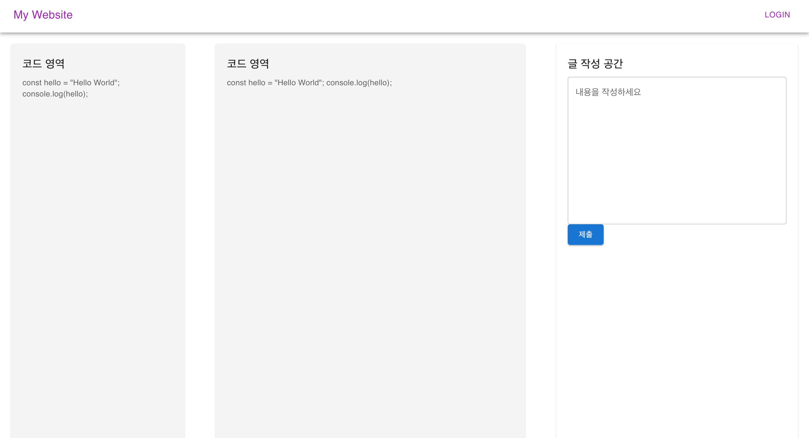

## My Coding Test 프로젝트 일지

### 24.12.23
- 크롬 익스텐션 기초 강의를 유튜브를 통해 시청
- 크롬 익스텐션 공식문서 간단히 훓기
- 간단한 익스텐션은 기본적인 HTML, CSS, Javascript 만 알아도 충분한걸 깨달음
- 크롬 익스텐션으로 백준사이트에서 나의 풀이 코드와 채점 결과를 가져오는것에 성공!
- 깃허브 리포지토리로 등록
### 24.12.24
- 어제 익스텐션 약간의 수정
- 프론트 이번기회에 리액트를 사용해서 컴포넌트기반으로 프론트 구성해보도록 결심
- 코딩앙마, 생활코딩, 코딩애플 유튜브 강의를 통해 기초적인 리액트 지식 습득
  - 작년에는 보아도 도저히 이해가 안갔지만 지금보니 너무 이해가 잘됨. 자신감이 붙음
- MUI를 사용하기로 결정
- 아래는 연습결과
- 24.12.26일까지 프로토타입 만들것

### 24.12.25
- 크롬 익스텐션 크게 개선
  - 백준에서는 채점시 여러 상태가 동적으로 표시됨. 예를들어 채점 중, 기다리는 중, 성공, 시간초과 등
  - 조건문에 "채점", "기다리"가 있으면 계속 대기하도록 수정 -> 이제 의도한 채점 결과만 읽어 들인다
  - 제출 코드와 채점 결과를 하나의 JSON으로 함쳐서 서버로 전송하도록 함
  - `localhost:8080/api/1` 로 POST 할것을 지정함
- Java Spring 
  - 크롬 익스텐션에서 POST 해줄 JSON을 받아서 DB에 저장할 백엔드
  - H2 데이터베이스를 사용할 예정. 파일모드로 변경하여 영속성이 되도록 수정
- 프론트
  - 어제 연습한거 기반으로 본격적으로 진행할 얘정임
  - vite 로 새로운 리액트 프로젝트 구성 완료
  - 프론트단은 서버와 익스텐션이 어느정도 완성된후에 집중 개발 예정

